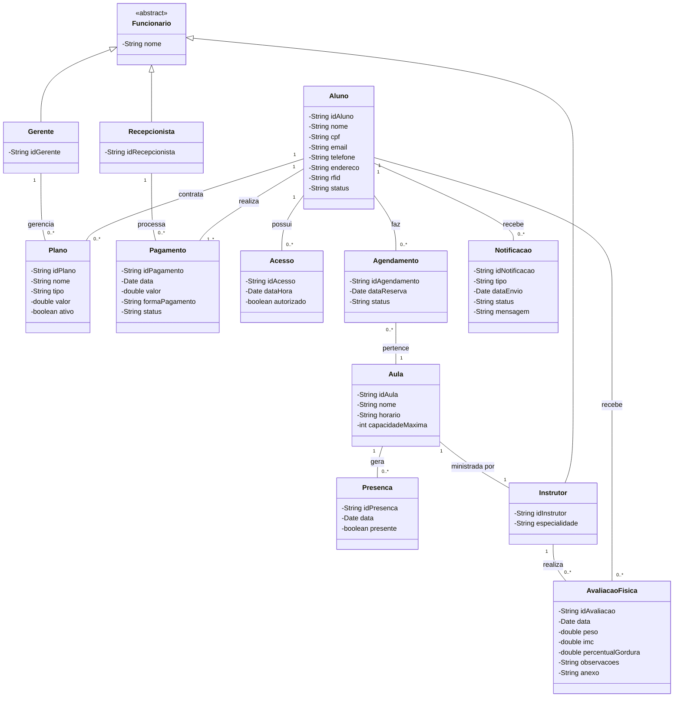

# 3. Modelagem de Classes

## 3.1. Esboço das Classes (Skeleton)
Estrutura inicial em código exigida para o domínio:

```java
class Aluno {}
class Plano {}
class Pagamento {}
class Acesso {}
class Aula {}
class Agendamento {}
class Presenca {}
class AvaliacaoFisica {}
class Notificacao {}

abstract class Funcionario {}
class Instrutor extends Funcionario {}
class Recepcionista extends Funcionario {}
class Gerente extends Funcionario {}
```

---

## 3.2. Dicionário de Dados e Atributos
Mapeamento das entidades com seus atributos baseados nos Requisitos Funcionais:

**Aluno** (RF01, RF04, RF05, RF06, RF10)
* idAluno, nome, cpf, email, telefone, endereco, rfid, status

**Plano** (RF01, RF02, RF04)
* idPlano, nome, tipo, valor, ativo

**Pagamento** (RF03, RF04, RF09)
* idPagamento, data, valor, formaPagamento, status

**Acesso** (RF05, RF09)
* idAcesso, dataHora, autorizado

**Aula** (RF06, RF07, RF09)
* idAula, nome, horario, capacidadeMaxima

**Agendamento** (RF06, RF10)
* idAgendamento, dataReserva, status

**Presenca** (RF07)
* idPresenca, data, presente

**AvaliacaoFisica** (RF08, RF10)
* idAvaliacao, data, peso, imc, percentualGordura, observacoes, anexo

**Notificacao** (RF10)
* idNotificacao, tipo, dataEnvio, status, mensagem

**Instrutor** (RF07, RF08)
* idInstrutor, nome, especialidade

**Recepcionista** (RF01, RF03)
* idRecepcionista, nome

**Gerente** (RF02, RF09)
* idGerente, nome

---

## 3.3. Diagrama de Classes do Domínio
*Abaixo está a representação visual do relacionamento entre as classes, gerada via Mermaid.*


```
